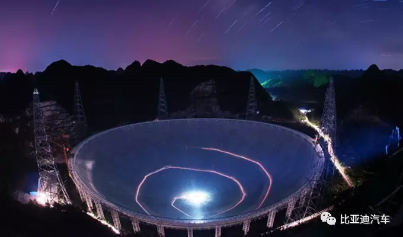

On July 23, the activity of “Travel of Control·Witness Strong China-BYD”in the first station of east line successfully ended in Qingdao, Shandong. Participants could not forget the self-improvement feelings on “Made in China” after perceiving the self-improvement growth process of Chinese war industry. 
If you have no chance to experience on the site by yourself, and you are longing for seen the magnificence of “Control·Witness the Strong China”, you shall grasp the chance to apply for the several successive activities. 

The next activity in the second station of west line will be held on July 29-31 in Guizhou. Xie Renjiang, the famous astronomy popularization expert and the founder of Bootes Astronomy Forum will take you to see the largest radiotelescope named “Chinese Eye in the Sky” in the world to touch the pulse beyond 13.7 billion light years!

### About Xie Renjiang

Xie Renjiang is the famous domestic astronomy “zealot”, he established the earliest astronomy forum--Bootes Astronomy Forum (it is also the largest astronomy website in China at present)--in China in 1999. As for Xie Renjiang, advocating astronomy popularization is not only favorite, but also the responsibility.

### About Radiotelescope in Pingtang, Guizhou

The 500m-caliber sphere radiotelescope (FAST) located in Pingtang, Guizhou is the radiotelescope with our proprietary intellectual property right, the globally largest single caliber and the highest sensitivity. It is praised as “Chinese Eye in the Sky”. The process from advanced research to construction completion lasted 22 years, and it was put into use on September 25, 2016.
It is so sensitive that it can receive the electromagnetic signal beyond 13.7 billion light years, getting information about interstellar interaction, even searching alien civilization possibly existed. Its sensitivity is about 10 times than that of 100m telescope of Bonn, Germany; and its overall performance is about 10 times than that of 350m telescope of Arecibo, USA

