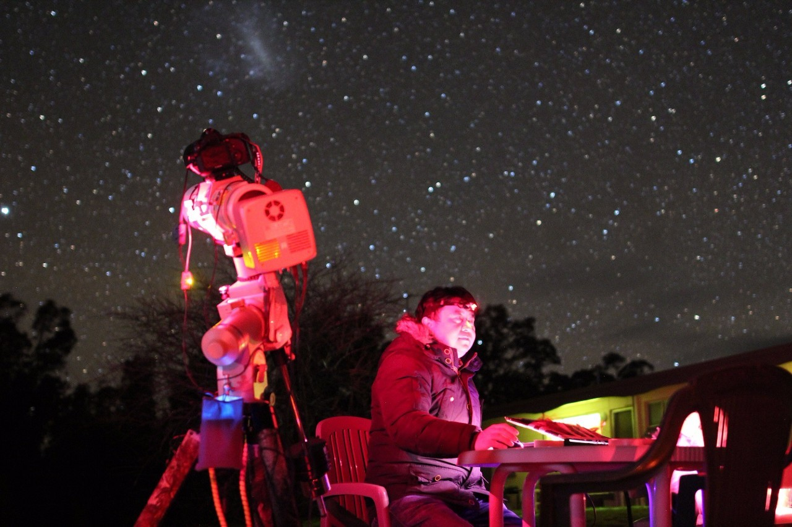
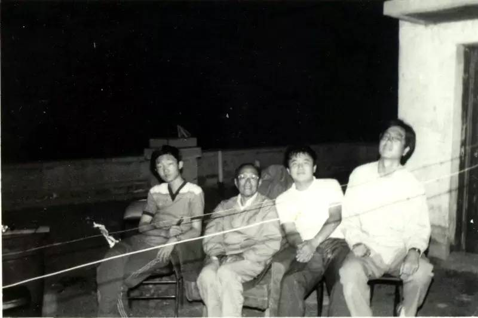
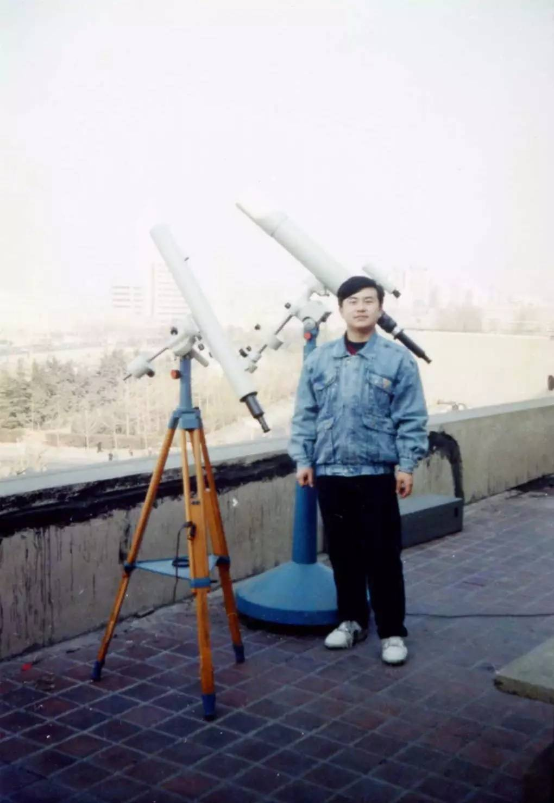
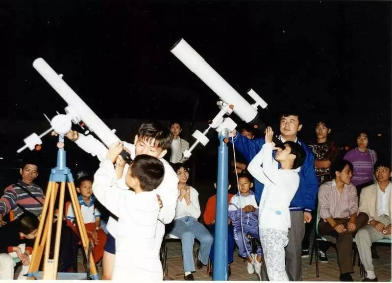
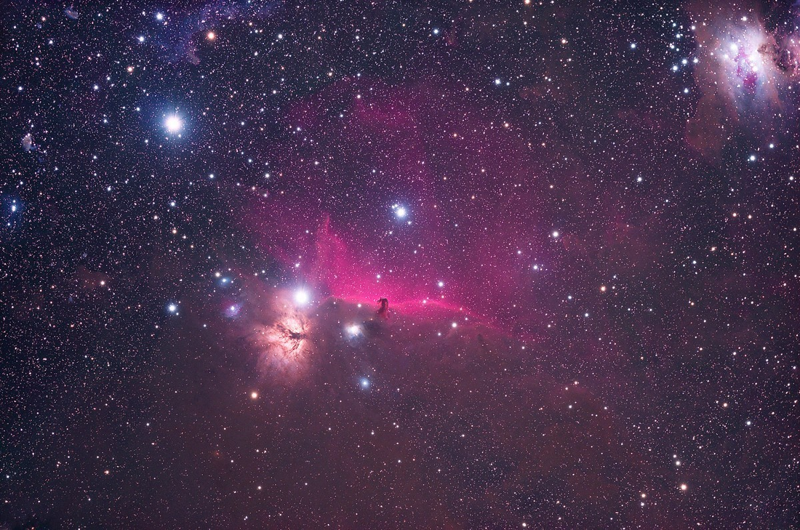
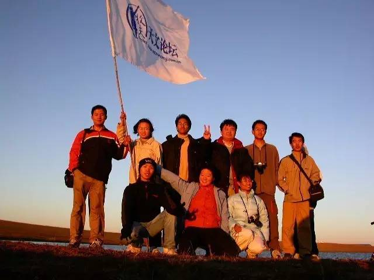
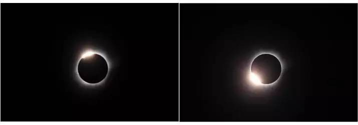

On the Mid-Autumn Festival of this year, driven by the trend of observing the moon, we interviewed Xie Renjiang, the chairman of Dalian Bootes Astronomical Society, founder of Bootes Astronomical Forum and top astronomer in China, who lived in Dalian. 

*Xie Renjiang who was shooting the starry sky.*

*In 1993, Xie Renjiang (the second one on the right) and his astronomy teacher were watching the Perseid meteor shower. *

Xie Renjiang's interest in astronomy began in 1986 when he observed the return of Halley's Comet for the first and only time. Halley's Comet returns every 76 years. That is to say, the next time we can see it may be between 1961 and 2062. Xie Renjiang was born in 1977 and he is 39 years old now. That is to say, Xie Renjiang will not meet it again until he is at least 84 years old.

In that year, when Xie Renjiang was just 9 years old, he went to Hainan to observe the Halley's Comet. After that, he began to have a strong interest in astronomy. When he returned to Dalian, Xie Renjiang who was in the primary school, met his first astronomy teacher in his life at the Children's Palace. With the in-depth understanding of astronomy knowledge, Xie Renjiang in the primary school had been able to calculate the trajectory of celestial movements by using calculus. 

China's reform and opening started in 1978. And in the north, the improvement of material conditions brought by it was more lagging behind. At that time, it was popular to make pen friends. Xie Renjiang who was in the junior middle school, made friends with astronomers from all over the country through the pen friends column of astronomy magazines. 

*This is a photo of Xie Renjiang who was 16 years old and the astronomical telescope at the Children's Palace.*

In the late 1980s and early 1990s, there was no telephone at almost every family and the mode of communication was relatively simple. In addition to sending letters, the fastest way of communication was to send telegrams. Even if it was a public phone, they had to make an appointment and wait in the public telephone hall to get on the phone. On the contrary, the inconvenience of communication brought great pleasure to Xie Renjiang as a teenager. It took one week to send a letter and half a month for the back and forth. The time became longer for the waiting, which just like the words in the song, "At that time, the vehicles and horses were very far, the letter was very slow, and it was only enough to love a person in life." Xie Renjiang's wife could be in the vast universe. He was waiting patiently for those "letters from the universe" and thought it silently in his heart, as if he was talking with the stars.

*Guided by Xie Renjiang, it was a roadside astronomical activity in Dalian. The picture is Xie Renjiang pointing to the star (first one on the right).*

*Horsehead Nebula taken by Xie Renjiang*

Later, with the popularity of Internet, Xie Renjiang and astronomers all over the country gradually became net friends from pen friends. They shared their observation experience and equipment on the Internet. If the condition was good, they got a developed astronomical photo, scanned at the printing shop and compressed it until it was enough small, and then uploaded it. Even if the picture was not so clear, it was very precious for astronomers at that time. Gradually, they found that the way of online communication was convenient and efficient, so Bootes Astronomical Forum was born... Nowadays, Bootes Astronomical Forum has won a great influence in the astronomical circle. As the moderator, Xie Renjiang often receives private telecommunications and telephone calls from net friends. Finding Xie Renjiang means that you can open the door to astronomy. Learning from Xie Renjiang also seems to be the secret key for astronomers to explore the universe and touch the starry sky with their eyes. 

*It is a photo of 2004 International Bootes Astronomical Exchange Meeting in Inner Mongolia, held by Bootes Astronomical Forum. Xie Renjiang is the third one on the right of second row. *

> Xie Renjiang asked me, “Xiao Gao, do you wear glasses?”
> I answered, “Yes, 525 degree for my left eye and 650 degree for my right eye.” 
> Then he asked me,”is there any astigmatism?”
> I was amused immediately. I said, “Teacher Xie, are you an ophthalmologist? It is the first time to met someone chatting about the degree of astigmatism.” 
> He said, "You don't understand. The astigmatism could affect the astronomical observations."
> After knowing Xie Renjiang, I understood a truth. Someone are crazy about their hobbies and then they become extremely professional, because the love is inherent, flowing in the blood just like the love of Xie Renjiang to astronomy and symphony.

During the conversation, Xie Renjiang corrected my statement about astronomy. He said astronomy was his hobby and what he did came from the instinctive love. Perhaps this is the feelings mentioned by others. For Xie Renjiang, it is natural and inherent. When we talked about the stars, I looked at his eyes. At that moment, Xie Renjiang who was 39 years old, seemed to be nine years old again in front of me. He saw the Halley's Comet hanging in the sky that year. He was curious and yearning for it. He said that Halley's Comet was very precious every time we saw it because it would encountered the drag friction when it flied in the universe, which would become a little smaller than the last time every time and even disappeared. When he left, he also invited us to observe the total solar eclipse in Mississippi of the United State next year. He said, “ It was once a year. And maybe it was unavailable the year after next. The universe is so big. Don't miss any chance to experience it!”

As for Xie Renjiang's love of symphonies, I never thought of it before. His every action showed his better upbringing and elegant life style. He said he loved Strauss and was fascinated by all the musics of the Strauss family. Drawing lots is required to buy the tickets of Vienna Concert. Those who can get the tickets for it are as lucky as winning a prize. To some extent, this system reduces the desire of many people to buy tickets. However, going to Vienna for a concert is one of Xie Renjiang's life goals. I heard that he had applied for the drawing lots for three years consecutively. Maybe next year he will take us to Vienna to see stars.

*Photo of solar eclipse taken by Xie Renjiang*